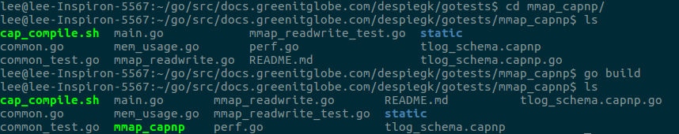

# gotests

This repo contains the code for the go tests. Code is grouped in different directories
for different tests, e.g. all the mmap code is in onde subdirectory, and the redis code is in another.

## installing

First create the directory structure:
```bash
mkdir $GOPATH/src/docs.greenitglobe.com/despiegk
```

Go looks for packages we import in very specific places, therefore it is important
to immediately put our source code in the right directory to avoid issues later on.

Now clone our repo with the sources:
```bash
cd $GOPATH/src/docs.greenitglobe.com/despiegk
git clone ssh://git@docs.greenitglobe.com:10022/despiegk/gotests.git
```

***Optional***: if code need to be run on a branch other than master, we first need to
switch to said branch.
```bash
git checkout BRANCH_NAME
```

As a last step, we need to download the dependencies:
```bash
cd gotests
go get ./...
```

When this is done, we have all the required code to start building

## building

To build the code for a group of tests, go into the directory and, from a terminal,
execute the `go build` command. This creates an executable in that directory. Information
about specific tests/executables can be found in the README.md file in their respective
directories. Example:

```bash
cd mmap_capnp
go build
```

This will create the `mmap_capnp` executable in the `mmap_capnp` directory.
Example:


An exception to this is the `capnp_benchmarks` directory. More details can be found
there in the [capnp_benchmarks' README.md](capnp_benchmarks/README.md)

### code documentation

Users new to go are advised to explore the `capnp_benchmark` subdirectory first.
Code in this directory is thoroughly documented and explained step by step. If at any
point something should not be clear, [the official go documentation](https://golang.org/doc/effective_go.html)
will probably have the answer
