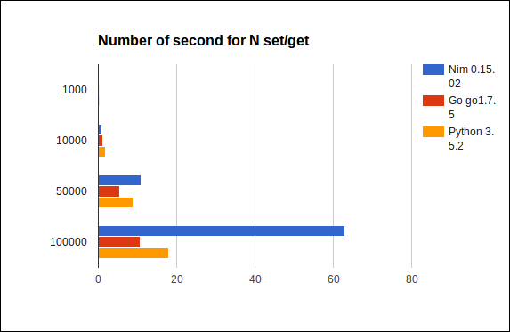

# Capnp Benchmarks

This repo holds 3 implementation of the same simple RPC server.
There is an implementation in go, nim and python.
The original repo can be found [here](https://docs.greenitglobe.com/rnd/capnp_bechmarks). More detailed information can be found in the respective directories, for example [go](go)

## Purpose:

To measure/benchmark performance of the rpc protocol in different languages

## Results :

| Number of get/set | Nim 0.15.2 | Go 1.7.5 | Python 3.5.2 |
|-------------------|------------|----------|-----------------|
| 1000 | 0 | 0.110525627 | 0.18 |
| 10000 | 1 | 1.109881015 | 1.79 |
| 50000 | 11 | 5.346517959 | 8.89 |
| 100000 | 63 | 10.74270548 | 18 |

