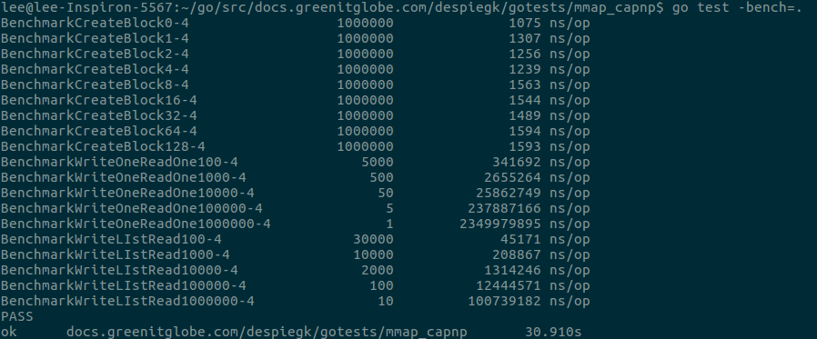

# mmap_capnp

This directory contains all the code related to the capnp mmap tests. The [schema](tlog_schema.capnp),
along with its [compiled version](tlog_schema.capnp.go), can be found in this directory
alongside all the code.
The tests are divided in 4 categories:

  1. Writing capnp messages to an (mmaped) file
  2. Check the memory usage of in-memory capnp messages
  3. Check the memory allocated while encoding/decoding capnp messages
  4. Test difference between reading from a regular file and a mmap file.

Additionally, there are also some benchmark tests provided. These can be found in the
xxx_test.go files (files with this kind of name are ignored by the compiler, so
they are not in the binary when it is compiled). They can be run by executing the
command `go test -bench=.` from this directory. The output is of the form:
```
Benchmarkxxxyyy     amount of function calls   time per function in nanoseconds
```

Where xxx is replaced by the function name to be benchmarked. In case of the
createBlock function yyy is replaced by the amount of extra data (in the string)
that is embedded in the message. For the other 2 functions, it is the amount of
capnp messages or tlog blocks to use.

An example run is shown here: 

The executable to run the test can be generated by running the `go build` command
in this directory. This generates 1 executable, the different tests to run are then
specified by running this executable with the specified flags. To see all available flags,
run with the -h flag: `./mmap_capnp -h`, or look below. By default, tests run with 1M
messages, but a command line flag is provided to change this number.

## Observations

  1. Writing encoded capnp messages to mmap file.

The base code for this can be found in [mmap_readwrite.go](mmap_readwrite.go).

There are 2 ways to write (encoded) capnp messages to a (mmaped) file (in our example).
The TlogBlock is the object we write. We have the following options:
    1. Create a single message. Then create a Tlog Aggregation object in said message.
    The aggregation has a list of TlogBlock items, which stores all our blocks.
    Finally, encode and write the aggregation object as a whole to the file.

    2. Create a message for every block. Encode and write each message separately.

The first approach has the advantage of initial write speed and variable data length
in the Tlog blocks. When we write our blocks, we simply encode and write the entire
aggregation object at once. Similarly, when we read the blocks, we read and decode
the entire aggregation object. Since the aggregation keeps track of where every block
sits for us, we can embed data with variable length in the blocks. As a disadvantage,
we have to rewrite the entire file every time we add or change a block. This is not
a problem when using mmap, as we can just change the data in RAM as we see fit, and
rewrite the file on disk only once when we are done.
