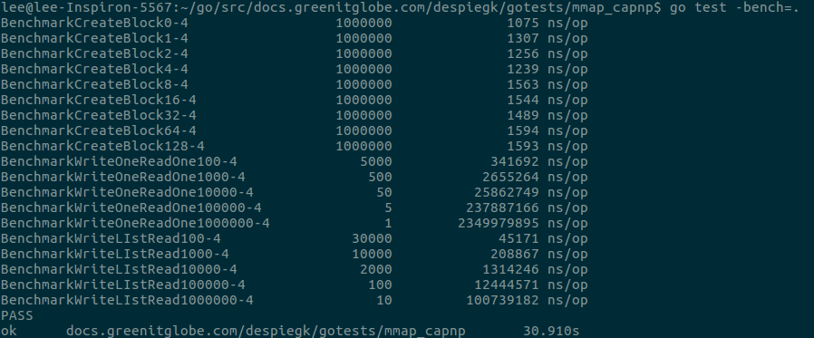
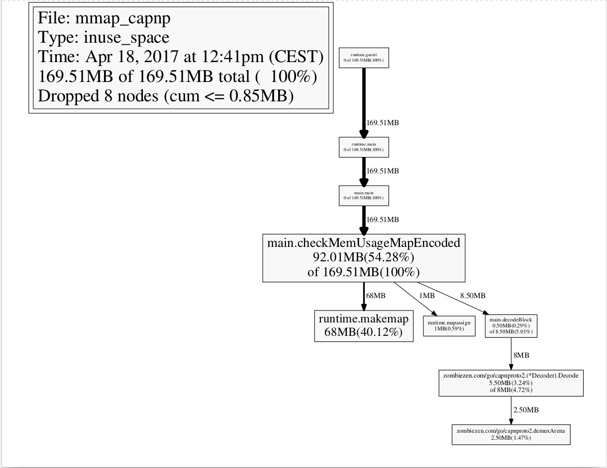
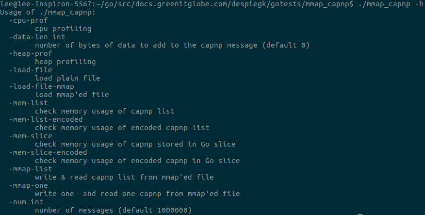

# mmap_capnp

This directory contains all the code related to the capnp mmap tests. The [schema](tlog_schema.capnp),
along with its [compiled version](tlog_schema.capnp.go), can be found in this directory
alongside all the code.
The tests are divided in 3 categories:

  1. Writing capnp messages to an (mmaped) file
  2. Check the memory usage of in-memory capnp messages
  3. Test difference between reading from a regular file and a mmap file.

Additionally, there are also some benchmark tests provided. These can be found in the
xxx_test.go files (files with this kind of name are ignored by the compiler, so
they are not in the binary when it is compiled). They can be run by executing the
command `go test -bench=.` from this directory. The output is of the form:
```
Benchmarkxxxyyy     amount of function calls   time per function in nanoseconds
```

Where xxx is replaced by the function name to be benchmarked. In case of the
createBlock function yyy is replaced by the amount of extra data (in the string)
that is embedded in the message. For the other 2 functions, it is the amount of
capnp messages or tlog blocks to use.

An example run is shown here: 

The executable to run the test can be generated by running the `go build` command
in this directory. This generates 1 executable, the different tests to run are then
specified by running this executable with the specified flags. To see all available flags,
run with the -h flag: `./mmap_capnp -h`, or look below. By default, tests run with 1M
messages, but a command line flag is provided to change this number.

The application also supports a -cpu-prof and a -heap-prof flag. When set, they will
try to create the `app.cpuprof` and `app.mprof` files in this directory, and try to
fill them with cpu profile and heap profile data, respectively. These files can then be
processed by the go pprof tool. To see all the options of the profiling tool, run the
`go tool pprof` command without any parameters. This will print a detailed overview
of the available options. For an in depth usage demo of the ppof tool, see
https://blog.golang.org/profiling-go-programs. Example usage of the tool:
```bash
./mmap_capnp -mem-map-encoded -heap-prof -data-len=50
go tool pprof -pdf app.mprof > mem-map-encode.pdf
```

This will run the test that checks how much memory is used when encoding and decoding
capnp messages stored in a map. Each message consists of a single Tlog block with
a sequence and string with lengths 50 (as specified by the `-data-len` flag, this
represents our arbitrary data). The test outputs the total amount of memory that has been
allocated during the encoding/decoding process. Finally, our application generates the
`app.mprof` file in this directory in which it recorded the heap profile. Then, the seconds
command generates a pdf file from this heap profile with more in-depth memory usage,
and saves it in the `mem-map-encode.pdf` file:



This does not report the amount of memory allocated, rather it reports the amount of memory in use
and which functions use (part of) said memory.


## Tests

The tests can be executed by running the application from the command line and
sending some command line flags. Here is a full overview of the flags:

  **Test Flags**

  - -mmap-list: reading and writing Tlog Blocks to a capnp list in a Tlog aggregation.
  This function is mainly useful to read the actual code and see how it works. Regardless,
  a benchmark test is provided for this function and will be executed when running the
  previously mentioned benchmark suite. The file is also memory mapped.

  - -mmap-one: like mmap-list, however, instead of writing the Tlog blocks in a
  Tlog aggregation, encode them and write them to the file directly. This means that
  blocks must have a fixed length. Again, a benchmark test is provided, the file that
  is being written is memory mapped, and this code serves more as an example how-to.

  - -mem-list: reports the memory usage of holding a capnp list stored in a Tlog aggregation.
  The actual memory used by the list is reported as `heap in use`.

  - -mem-slice: reports the memory usage of holding our Tlog blocks in a slice. Every
  block is stored in its own message. The total memory used by the slice is the sum of
  the printed `heap in use` and the separately printed `slice of buffer`.

  - -mem-list-encoded: like mem-list, but the Tlog aggregation with the list is encoded

  - -mem-slice-encoded: like mem-slice, but the capnp messages holding our Tlog blocks are
  encoded before they are stored in the slice.

  - -load-file: encode a Tlog aggregation with a list of Tlog blocks, and write it to a file.
  Then time how long it takes to decode the blocks from the file.

  - -load-file-mmap: like -load-file, but mmap the file first and then decode from the mmaped file
  that is being held in memory.

  At leat one of these flags must be specified every time the application is executed

  **Profile Flags**

  - -cpu-prof: create an `app.cpuprof` file in this directory that can be used to generate
  a cpu profile of the specified test(s).

  - -heap-prof: create an `app.mprof` file in this directory that can be used to generate
  a heap profile of the specified test. Since the heap info is dumped after the tests are done,
  it is best to only execute a single test in combination with this flag to get accurate results.

  As previously mentioned, the `go tool pprof` command can be used to process these files.

  **Flags that change default test behaviour**

  - -num: sets the amount of Tlog blocks that will be used in the tests. Default: 1M

  - -data-len: sets the amount of bytes that will be stored in the Tlog blocks as extra data.
  Default: 0


A short summary of every flag is also available when running the application with the `-h`
flag:


